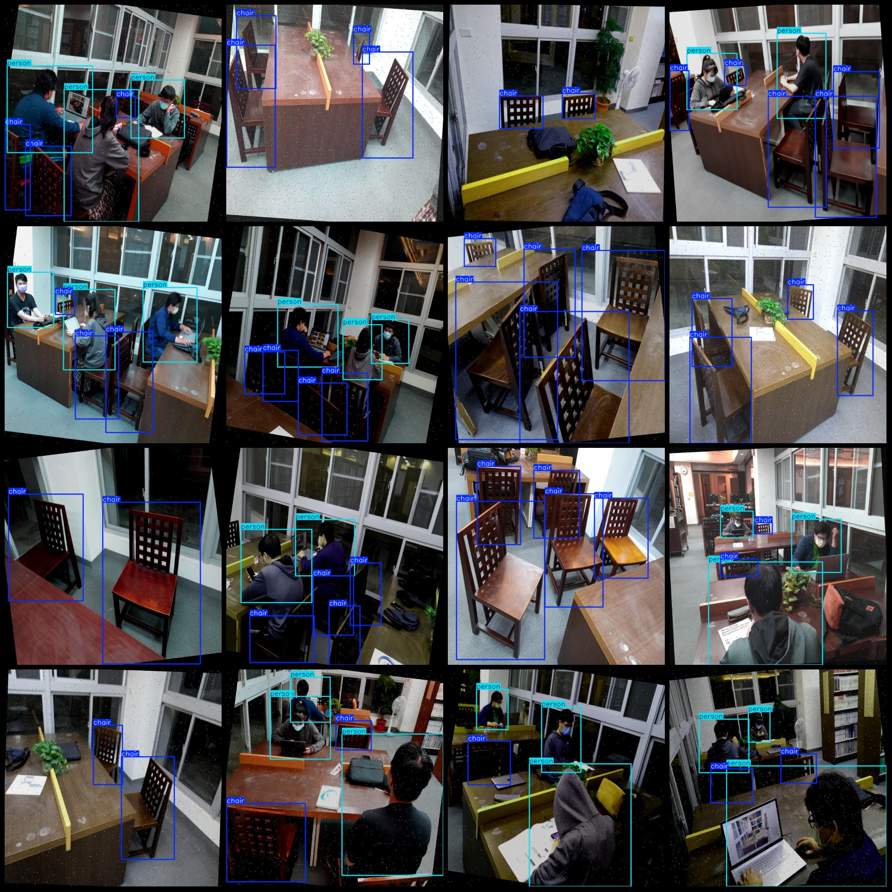
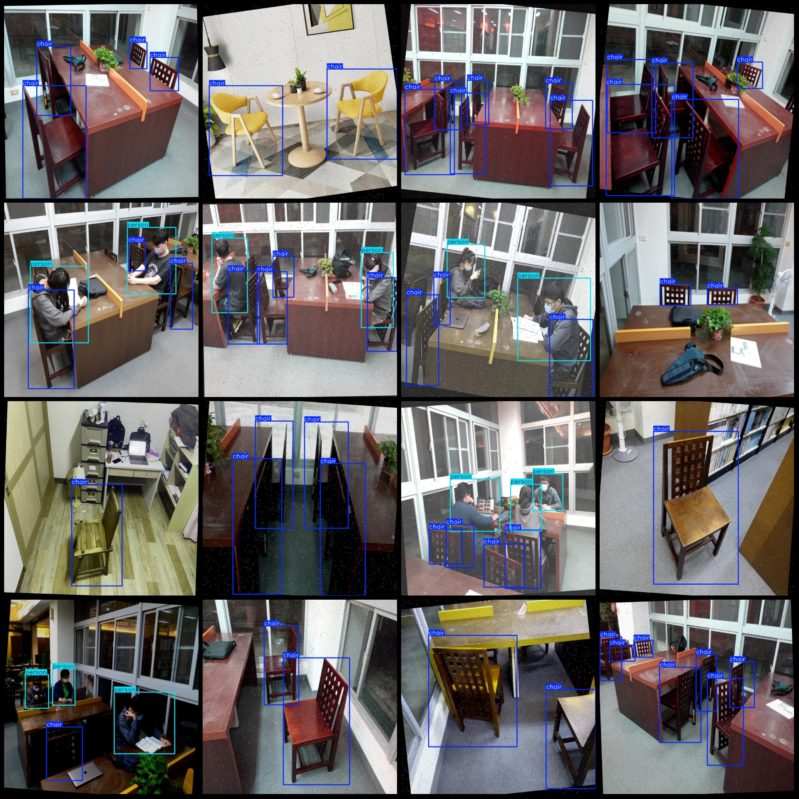

# Library Spotting Dataset in VOC+YOLO Format with 2568 Entries in 2 Classes with Enhanced Features

Please note that in the dataset images, about 988 are original and the remaining are rotation-augmented.

Dataset format: Pascal VOC format+YOLO format(without split path, only the txt file containing jpg images and corresponding VOC formatxml file and yolo format txt file)

Number of image files (jpg): 2568
Number of annotation files (xml): 2568
Number of annotation files (txt): 2568
Number of annotation categories: 2
Annotation category names (based on classes.txt in the labels folder): ["chair", "person"]

Number of boxes annotated per category:
- chairbox count = 7434
- personbox count = 3016
total boxes: 10450

Number of images per category:
- chairimages = 2464
- person holds 1300 images

Image resolution: 640x640
Using annotation tool: labelImg
Annotation rule: draw a rectangle box around the class.

Important Notice: The dataset does not have a split into training, validation, and test sets; you should manually divide it.
Special Disclaimer: This dataset does not guarantee the accuracy of the trained model or weight files.

Image preview:
## Image

Here is a pay link on Stripe ( https://buy.stripe.com/3cs8yP7sY87d0vu9AB ). Please contact me lonlonago@foxmail.com after funding $89, and I will send you a complete data files , thank you!

